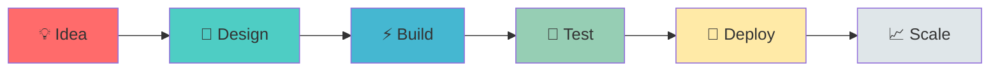

<div align="center">

# 👨‍💻 Moses Mbugua

**Full-Stack Engineer · Mobile Architect · DevOps Specialist**

🇰🇪 Nairobi, Kenya · [mbuguam323@gmail.com](mailto:mbuguam323@gmail.com)

</div>

---

## 🚀 Tech Arsenal

<table>
<tr>
<td width="33%" valign="top">

### ⚙️ Backend
```
├─ Laravel & PHP
├─ REST APIs
├─ M-Pesa Integration
└─ Payment Gateways
```

</td>
<td width="33%" valign="top">

### 📱 Mobile
```
├─ Flutter
├─ Kotlin
├─ Cross-Platform
└─ Native Performance
```

</td>
<td width="33%" valign="top">

### 🎨 Frontend
```
├─ Blade Templates
├─ HTML5 & CSS3
├─ Responsive Design
└─ Modern UI/UX
```

</td>
</tr>
<tr>
<td width="33%" valign="top">

### 🗄️ Database
```
├─ MySQL
├─ Supabase
├─ Schema Design
└─ Query Optimization
```

</td>
<td width="33%" valign="top">

### 🐳 DevOps
```
├─ Docker
├─ CI/CD Pipelines
├─ Linux Admin
└─ Containerization
```

</td>
<td width="33%" valign="top">

### 🔧 Tools
```
├─ Git & GitHub
├─ VS Code
├─ Postman
└─ Cloud Platforms
```

</td>
</tr>
</table>

---

## 💼 What I'm Building

<table>
<tr>
<td width="50%">

### 🏪 **Enterprise POS System**
> Full-stack point-of-sale platform
- Real-time inventory tracking
- Multi-location support
- Integrated payments
- Laravel + Modern frontend

</td>
<td width="50%">

### 💳 **Payment Solutions**
> Seamless checkout experiences
- M-Pesa integration
- Transaction workflows
- Webhook handling
- Reconciliation logic

</td>
</tr>
<tr>
<td width="50%">

### 📲 **Mobile Applications**
> Cross-platform Flutter apps
- Native performance
- Offline-first architecture
- Smooth animations
- Delightful UX

</td>
<td width="50%">

### 🛠️ **Infrastructure**
> Production-ready systems
- Docker containerization
- Automated deployments
- Scalable architecture
- Linux environments

</td>
</tr>
</table>

---

## 📊 Development Focus



---

## 🎯 Expertise Areas

| Area | Technologies | Experience |
|------|-------------|------------|
| **Backend** | Laravel, PHP, REST APIs | ████████░░ 80% |
| **Mobile** | Flutter, Kotlin | ███████░░░ 70% |
| **Frontend** | HTML, CSS, Blade | ███████░░░ 70% |
| **Database** | MySQL, Supabase | ████████░░ 80% |
| **DevOps** | Docker, CI/CD, Linux | ██████░░░░ 60% |

---

<div align="center">

### 💬 Let's Connect

Building something interesting? Let's talk.

**📧 mbuguam323@gmail.com**

---


*Crafting digital experiences from Nairobi* 🚀

</div>